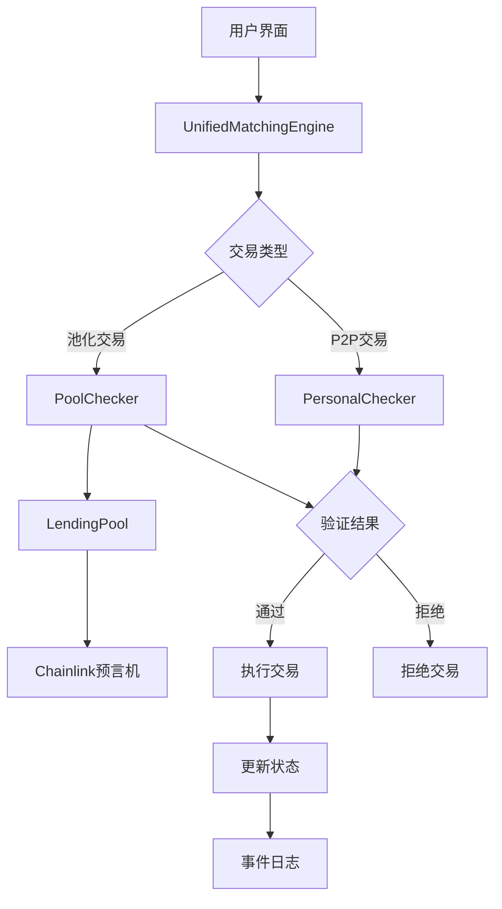

# 项目架构文档

## 项目概述

FixRate 是一个基于以太坊的去中心化固定利率借贷平台，允许用户以固定利率借出和借入加密货币。该平台通过智能合约实现，具有安全、透明和无需许可的特点。

平台采用模块化架构设计，包含统一撮合引擎、Checker验证模块和借贷池等核心组件，支持个人对个人(P2P)借贷和池化资金借贷两种模式。

## 系统架构

### 整体架构图



### 核心组件

1. **智能合约层**
   - UnifiedMatchingEngine.sol: 统一撮合引擎合约
   - IChecker.sol: 通用Checker接口合约
   - PersonalChecker.sol: 个人交易验证Checker实现
   - PoolChecker.sol: 池化资金验证Checker实现
   - FixedRateLendingPool.sol: 固定利率借贷池合约
   - LiquidityMining.sol: 流动性挖矿合约
   - 辅助合约和接口

2. **前端应用层**
   - React + Material-UI 构建的用户界面
   - Web3 集成用于与区块链交互
   - 多网络支持

3. **数据层**
   - Chainlink 价格预言机提供准确的资产价格
   - 本地存储用户设置和偏好

## 智能合约详解

### 1. UnifiedMatchingEngine.sol

这是平台的核心合约，负责交易撮合、订单管理和状态跟踪。

#### 主要功能
- 订单管理（创建、取消、状态跟踪）
- 交易撮合（调用相应的Checker进行验证）
- 资金流转控制（协调各方资金转移）
- 事件发布（记录交易过程）

#### 核心数据结构
```solidity
// 交易订单结构
struct LoanOrder {
    address checker;         // Checker合约地址
    address lender;          // 出借人地址
    address borrower;        // 借款人地址
    address lendToken;       // 借出代币地址
    uint256 lendAmount;      // 借出金额
    address collateralToken;  // 抵押代币地址
    uint256 collateralAmount; // 抵押金额
    uint256 interestRate;    // 利率（基点）
    uint256 duration;        // 借款期限（秒）
    uint256 expiry;          // 过期时间
    uint256 nonce;           // 随机数
    bytes signature;         // 签名数据
}
```

#### 主要事件
- BorrowRequestInitiated: 借款请求发起
- LendRequestInitiated: 出借请求发起
- BorrowExecuted: 借款执行
- LendExecuted: 出借执行
- OrderCancelled: 订单取消

### 2. IChecker.sol / PersonalChecker.sol / PoolChecker.sol

Checker合约专门负责交易前的风险控制和合规性检查。

#### 主要功能
- PersonalChecker: 验证个人对个人交易
- PoolChecker: 验证池化资金交易
- 不处理资金转移，仅提供验证服务
- 与Chainlink预言机集成进行资产价值评估

#### 核心接口函数
```solidity
// 验证出借人订单有效性
function verifyLenderOrder(VerificationParams calldata params) external view returns (bool)

// 验证借款人订单有效性
function verifyBorrowerOrder(VerificationParams calldata params) external view returns (bool)

// 获取Checker信息
function getCheckerInfo() external view returns (string memory name, string memory version)
```

### 3. FixedRateLendingPool.sol

这是一个固定利率借贷池合约，允许用户存入资产赚取利息。

#### 主要功能
- 存款和提款
- 与UnifiedMatchingEngine集成
- LP Token机制
- 订单检查和执行

#### 核心特性
- ERC20 LP Token: 用户存款后会获得代表其份额的LP Token
- 价格预言机集成: 使用Chainlink获取准确的资产价格
- 参数化配置: 可配置最低利率、最长借款期限等参数

#### LP Token机制
当用户向借贷池存款时，会收到相应的LP Token，代表其在池中的份额。这些Token可以在之后用于提款。

### 4. LiquidityMining.sol

流动性挖矿合约允许用户质押代币以获得奖励。

#### 主要功能
- 质押和提取
- 奖励分发
- 多池支持
- 紧急提取功能

## 前端架构

### 技术栈
- React 18
- Material-UI 组件库
- Ethers.js 用于区块链交互
- React Router 用于路由管理

### 主要页面组件
1. Home.js: 首页，展示平台概览
2. P2PMarketplace.js: P2P市场页面
3. LendingPool.js: 借贷池页面
4. LiquidityMining.js: 流动性挖矿页面
5. MyOrders.js: 我的订单页面
6. Settings.js: 设置页面

### 核心上下文
1. Web3Context.js: 管理Web3连接和合约实例
2. ApiContext.js: 管理API配置

## 部署架构

### 网络支持
- 以太坊主网
- Polygon主网
- BSC主网
- Sepolia测试网
- Mumbai测试网
- BSC测试网
- 本地开发网络(Hardhat/Ganache)

### 部署流程
1. 部署基础接口合约
2. 部署Checker合约
3. 部署LendingPool合约
4. 部署UnifiedMatchingEngine合约
5. 配置各组件间的关系

## 安全考虑

### 合约安全
- 使用OpenZeppelin库确保标准实现
- 重入攻击防护
- 访问控制限制
- 时间锁机制
- 签名防重放攻击

### 前端安全
- 输入验证
- 钱包连接安全
- 网络切换检测

## 扩展性设计

### 模块化设计
合约采用模块化设计，便于扩展和维护。Checker机制支持第三方开发者实现自定义验证逻辑。

### 可配置参数
关键参数可通过治理机制进行调整。

## 性能优化

### Gas优化
- 链下订单存储，链上只保存状态
- 合理的数据结构设计
- 状态变量打包
- 避免不必要的计算

### 前端优化
- 懒加载组件
- 缓存机制
- 响应式设计