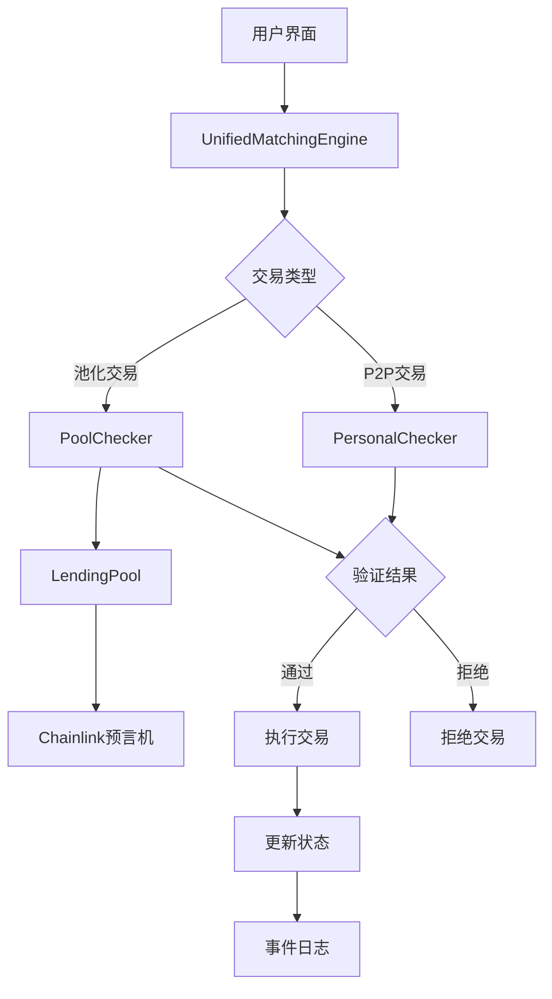

# 技术文档：系统架构概览

## 1. 概述

本文档提供了对统一撮合引擎、Checker合约和借贷池集成方案的整体架构概览，阐述了各个组件之间的关系和交互方式。

## 2. 系统架构图

## 3. 组件关系说明

### 3.1 UnifiedMatchingEngine（统一撮合引擎）
作为系统的核心组件，UnifiedMatchingEngine负责：
- 订单管理（创建、取消、状态跟踪）
- 交易撮合（调用相应的Checker进行验证）
- 资金流转控制（协调各方资金转移）
- 事件发布（记录交易过程）

### 3.2 Checker合约
Checker合约专门负责交易前的风险控制和合规性检查：
- **PersonalChecker**: 验证个人对个人交易
- **PoolChecker**: 验证池化资金交易
- 不处理资金转移，仅提供验证服务
- 与Chainlink预言机集成进行资产价值评估

### 3.3 LendingPool（借贷池）
LendingPool作为资金提供方，负责：
- 资金管理（存款、提款、借贷、还款）
- 收益分配（利息计算和分发）
- LP Token管理（代表用户份额的凭证）
- 与PoolChecker配合确保资金安全

## 4. 数据流说明

### 4.1 交易创建流程
1. 用户通过界面创建交易订单
2. UnifiedMatchingEngine接收订单并生成订单哈希
3. 根据交易类型选择相应的Checker进行验证
4. Checker调用Chainlink预言机获取资产价格
5. 验证通过后，UnifiedMatchingEngine协调资金转移
6. 更新订单状态并发布事件

### 4.2 资金流动流程
1. 存款：用户 -> LendingPool -> LP Token发行
2. 借贷：LendingPool -> 借款人（通过UnifiedMatchingEngine）
3. 还款：借款人 -> LendingPool（通过UnifiedMatchingEngine）
4. 提款：LendingPool -> 用户（销毁LP Token）

## 5. 安全机制

### 5.1 分层验证
- 签名验证：确保订单真实性和完整性
- 参数验证：检查交易参数合规性
- 资产验证：通过预言机验证抵押物价值
- 资金验证：确保池中有足够资金

### 5.2 防重放攻击
- 使用nonce机制防止签名重复使用
- 订单状态跟踪防止重复执行
- 撮合合约记录已处理订单

### 5.3 权限控制
- 各合约具有明确的权限范围
- 关键操作需要授权访问
- 管理员可以配置系统参数

## 6. 扩展性设计

### 6.1 模块化架构
- 各组件职责明确，松耦合
- 支持自定义Checker实现
- 支持多种资产类型

### 6.2 可升级性
- 合约支持升级机制
- 参数支持动态调整
- 支持新增功能模块

## 7. 性能优化

### 7.1 Gas优化
- 链下订单存储，链上只保存状态
- 批量操作减少交互次数
- 高效的数据结构设计

### 7.2 查询优化
- 提供丰富的查询接口
- 支持事件订阅机制
- 状态缓存减少重复计算

## 8. 部署建议

### 8.1 部署顺序
1. 部署基础接口合约
2. 部署Checker合约
3. 部署LendingPool合约
4. 部署UnifiedMatchingEngine合约
5. 配置各组件间的关系

### 8.2 初始化配置
- 设置预言机地址
- 配置验证参数
- 添加支持的资产类型
- 设置管理员权限

## 9. 监控和维护

### 9.1 状态监控
- 订单状态跟踪
- 资金流动监控
- 异常事件告警

### 9.2 维护策略
- 定期更新预言机地址
- 调整池参数以适应市场变化
- 升级合约以修复漏洞或增加功能