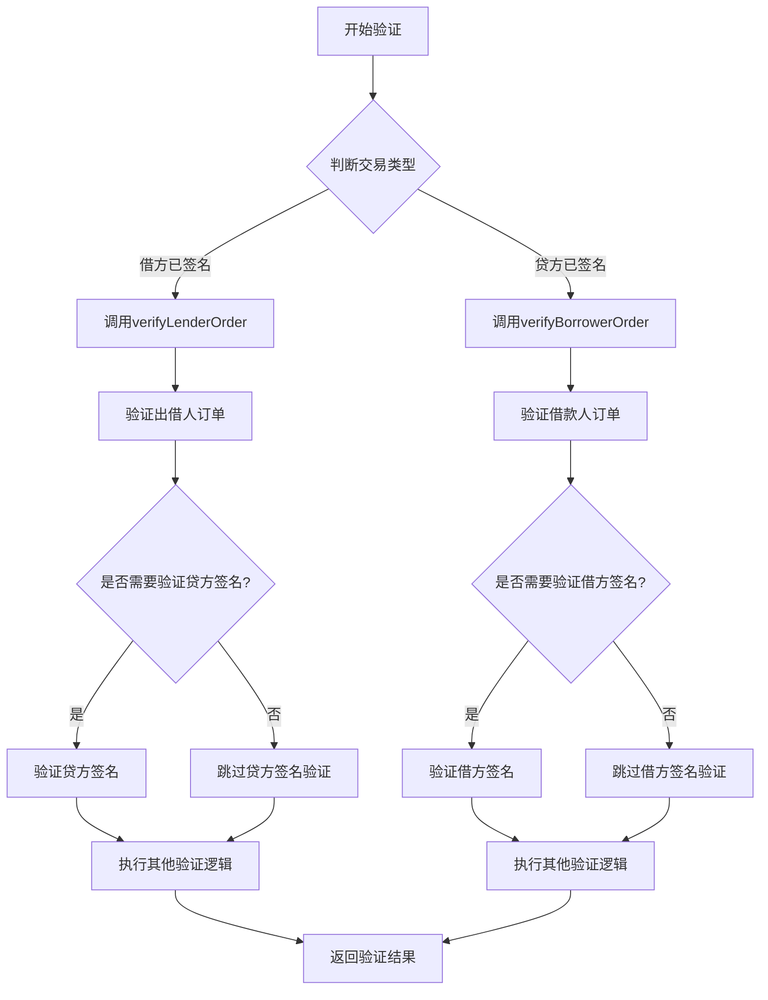
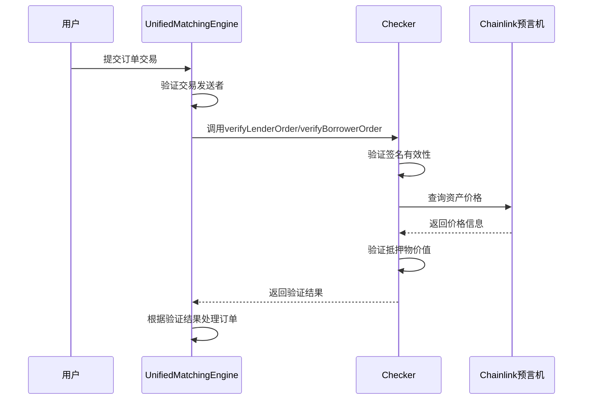
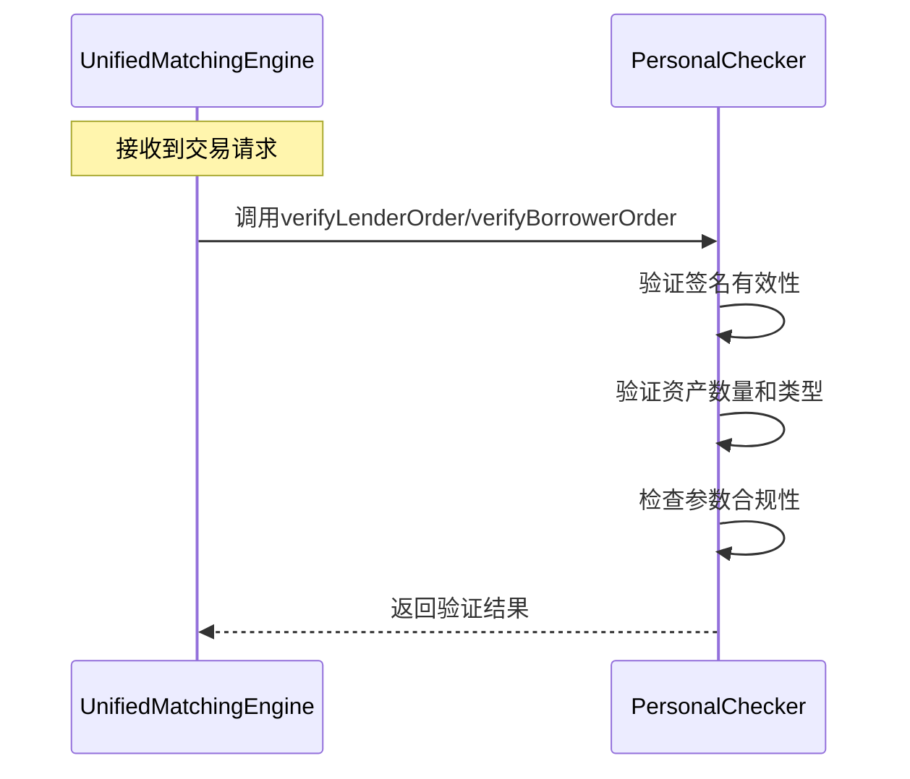
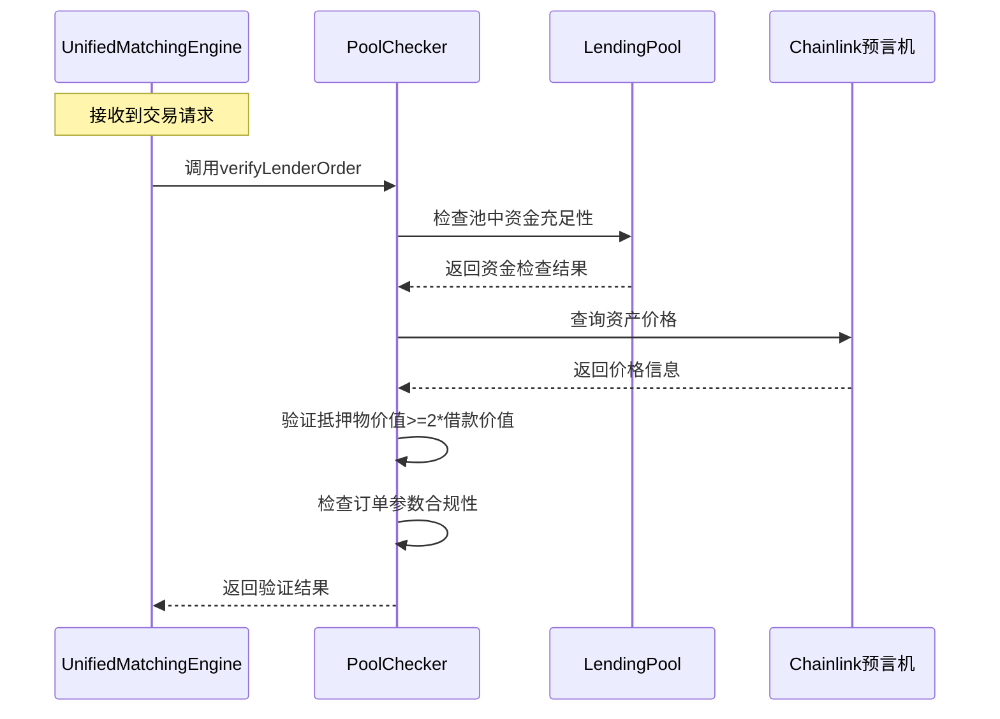

# 技术文档：Checker合约设计

## 1. 概述

Checker合约是一组用于验证借贷交易有效性的智能合约，包括通用接口和多种实现。Checker合约通过验证签名、资产价值等条件，确保交易的安全性和合规性。

## 2. 设计目标

1. 提供标准化的验证接口，支持多种验证逻辑
2. 确保Checker本身的安全性
3. 支持个人交易和池化资金交易的不同验证需求
4. 允许第三方开发者实现自定义验证逻辑

## 3. 验证流程图

下面的流程图展示了Checker的验证流程：



下面的流程图展示了订单的生命周期：

```mermaid
graph TD
    A[创建订单] --> B{订单状态}
    B -->|有效| C[等待撮合]
    C --> D{交易执行}
    D -->|成功| E[订单完成]
    D -->|失败| F[订单失效]
    B -->|取消| G[cancelOrder(nonce)]
    G --> H[标记nonce为已使用]
    H --> I[订单取消]
```

下面的时序图展示了订单验证流程：



## 3. 核心组件

### 3.1 主要合约
- **IChecker**: 通用checker接口合约
- **PersonalChecker**: 个人交易验证checker实现
- **PoolChecker**: 池化资金验证checker实现

### 3.2 数据结构

#### 3.2.1 交易验证参数

Checker验证时使用的参数直接来源于LoanOrder结构体，包含以下字段：

- `address checker`: Checker合约地址
- `address lender`: 出借人地址
- `address borrower`: 借款人地址
- `address lendToken`: 借出代币地址
- `uint256 lendAmount`: 借出金额
- `address collateralToken`: 抵押代币地址
- `uint256 collateralAmount`: 抵押金额
- `uint256 interestRate`: 利率（基点）
- `uint256 duration`: 借款期限（秒）
- `uint256 expiry`: 过期时间
- `uint256 nonce`: 随机数
- `bytes signature`: 签名数据

## 4. IChecker接口设计

### 4.1 核心接口函数

#### 4.1.1 验证出借人订单有效性
```solidity
function verifyLenderOrder(VerificationParams calldata params) external view returns (bool)
```
验证出借人订单是否符合要求。当借方已签名、贷方提交上链时调用此接口，此时不再需要验证贷方签名。撮合合约可以直接获取交易的msg.sender，因此只需验证链下签名的有效性。注意：此函数不会验证贷款方的地址，因为贷款方是由平台撮合的，可能是随机的。

#### 4.1.2 验证借款人订单有效性
```solidity
function verifyBorrowerOrder(VerificationParams calldata params) external view returns (bool)
```
验证借款人订单是否符合要求。当贷方已签名、借方提交上链时调用此接口，此时不再需要验证借方签名。撮合合约可以直接获取交易的msg.sender，因此只需验证链下签名的有效性。注意：此函数不会验证借款方的地址，因为借款方是由平台撮合的，可能是随机的。

#### 4.1.3 获取Checker信息
```solidity
function getCheckerInfo() external view returns (string memory name, string memory version)
```
获取Checker的基本信息。

## 5. PersonalChecker实现

### 5.1 功能特点
- 验证个人间的借贷交易
- 根据调用接口的不同，分别验证出借人或借款人签名的有效性
- 验证资产价值和抵押率（基于双方认可，无需预言机）
- 支持自定义验证规则

### 5.2 核心验证逻辑

#### 5.2.1 签名验证
根据调用的接口（verifyLenderOrder或verifyBorrowerOrder），在需要时验证相应方的签名是否有效，确保订单的真实性。在借方签名、贷方提交上链的情况下，调用verifyLenderOrder时不再验证贷方签名；在贷方签名、借方提交上链的情况下，调用verifyBorrowerOrder时不再验证借方签名。每个签名只生效一次，撮合合约会记录lender+nonce或borrower+nonce的状态为true，下次尝试再使用它，会因为已经为true而出错。

下面的时序图展示了PersonalChecker在个人对个人交易中的验证流程：



#### 5.2.2 资产价值验证
对于个人对个人的交易，资产价值验证基于交易双方的认可，无需依赖预言机。验证主要关注抵押资产的数量和类型是否符合订单要求。

#### 5.2.3 参数合规性检查
检查利率、期限等参数是否在合理范围内。

## 6. PoolChecker实现

### 6.1 功能特点
- 专门用于池化资金的借贷验证
- 只提供出借接口验证（verifyLenderOrder），因为PoolChecker中存储的资产都是出借人的资产，不会存放借款人的资产
- 验证池中资金充足性
- 检查抵押资产价值，要求抵押物价值>=2*借款价值

### 6.2 核心验证逻辑

#### 6.2.1 资金可用性检查
检查池中是否有足够的资金用于出借。

下面的时序图展示了PoolChecker在池化资金交易中的验证流程：



#### 6.2.2 抵押资产验证
验证借款人提供的抵押资产价值是否满足池的要求，要求抵押物价值>=2*借款价值（可通过Chainlink预言机提供资产价格来计算价值）。

#### 6.2.3 池参数验证
检查订单参数是否符合池的配置要求（如最低利率、最长期限等）。

## 7. 自定义Checker开发

### 7.1 开发指南
第三方开发者可以通过实现IChecker接口来开发自定义的验证逻辑。

### 7.2 必须实现的函数
- `verifyLenderOrder`: 验证出借人订单逻辑
- `verifyBorrowerOrder`: 验证借款人订单逻辑
- `getCheckerInfo`: 返回Checker信息

### 7.3 安全建议
- 实现充分的输入验证
- 使用安全的随机数生成
- 避免重入攻击风险
- 实现适当的访问控制

## 8. 安全机制

### 8.1 Checker地址验证
在撮合合约中验证Checker地址是否为已注册的合法Checker合约。

### 8.2 验证逻辑安全
采用多重验证机制，确保交易的安全性。

### 8.3 权限控制
通过访问控制确保只有授权方可以更新Checker配置。

### 8.4 签名防重放攻击
每个签名只生效一次，撮合合约会记录lender+nonce或borrower+nonce的状态为true，下次尝试再使用它，会因为已经为true而出错。用户取消交易，也应该是直接设置状态为true。

### 8.5 抵押物价值验证
对于Pool交易，通过Chainlink预言机获取资产价格，验证抵押物价值是否满足要求（>=2*借款价值），确保资金安全。对于个人对个人交易，抵押物价值验证基于交易双方的认可，无需依赖预言机。

## 9. 事件日志

### 9.1 核心事件
- CheckerVerified: Checker验证通过
- OrderVerified: 订单验证通过
- VerificationFailed: 验证失败

## 10. 部署架构

### 10.1 合约部署顺序
1. 部署IChecker接口合约
2. 部署PersonalChecker合约
3. 部署PoolChecker合约
4. 在UnifiedMatchingEngine中注册Checker地址

### 10.2 初始化配置
- 设置预言机地址
- 配置验证参数
- 设置管理员权限