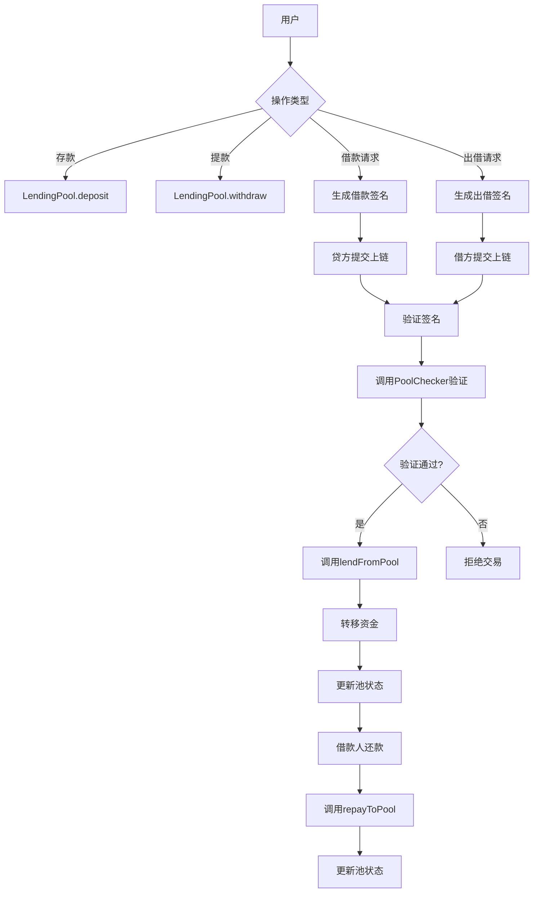
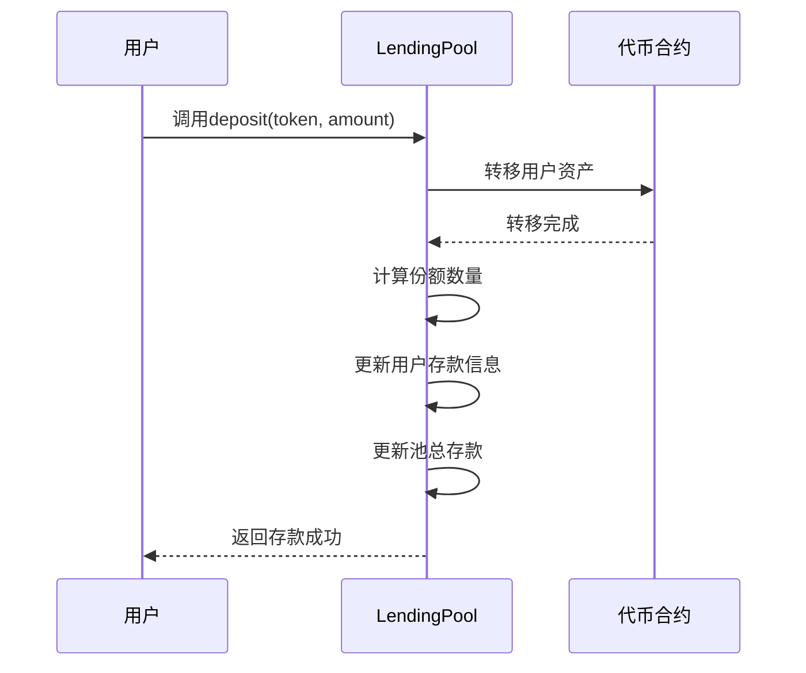
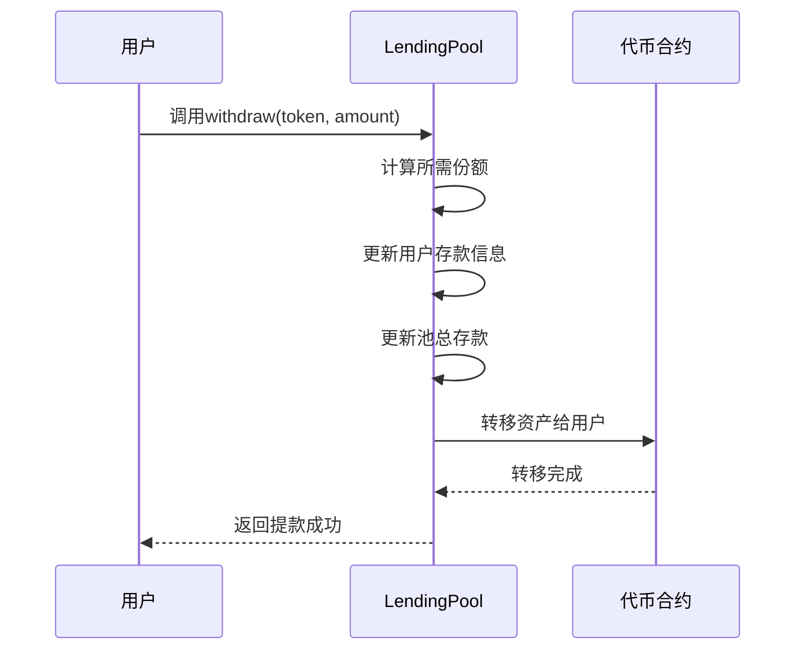
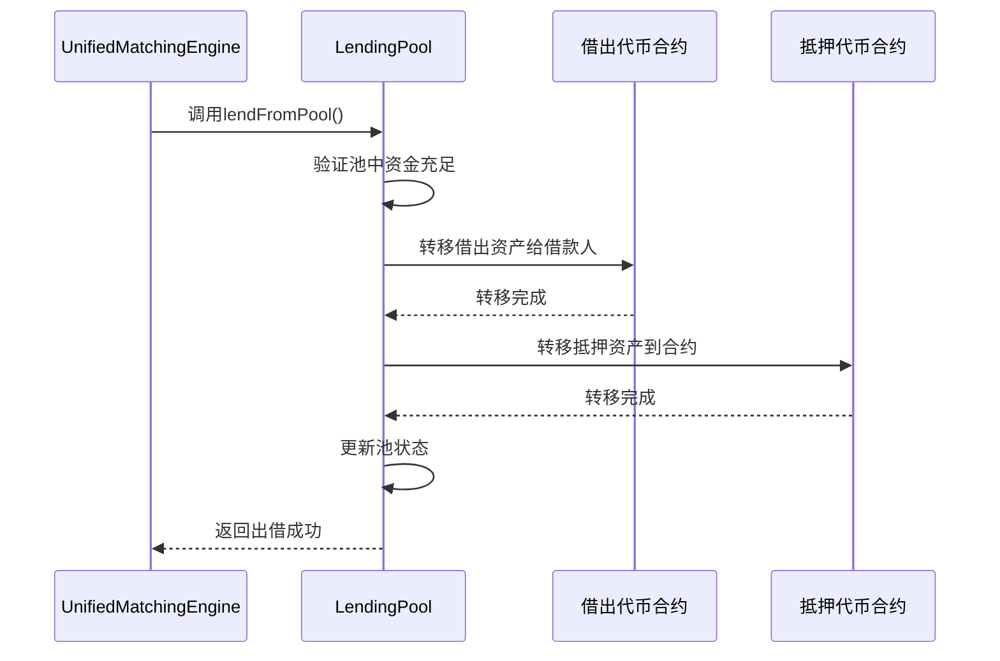
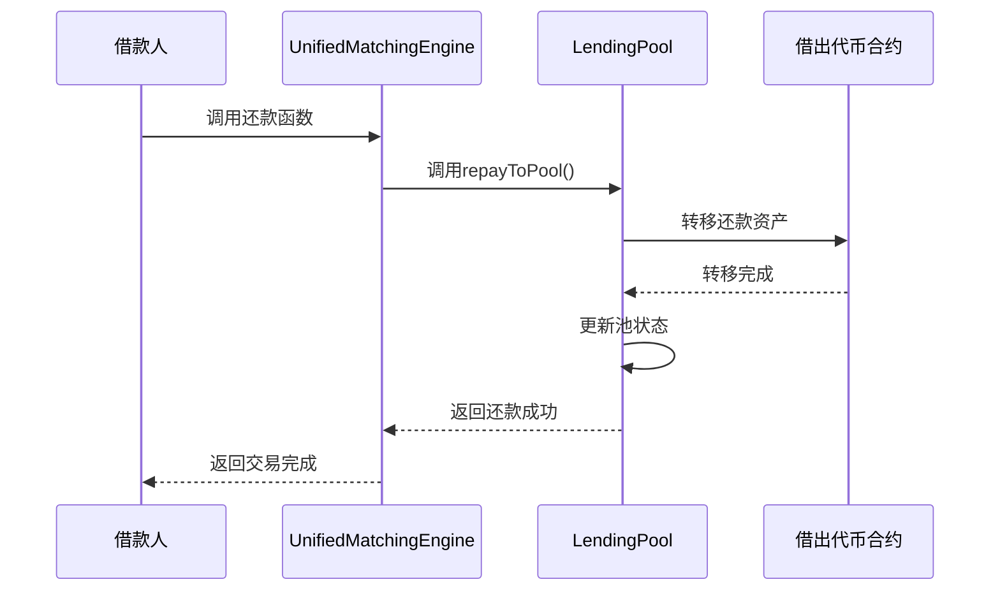

# 技术文档：借贷池集成方案设计

## 1. 概述

借贷池集成方案是将传统的点对点借贷扩展为支持资金池的混合型借贷模式。该方案允许用户将资产存入资金池获得利息，同时也支持从资金池借款，提高了资金利用率和流动性。

LendingPool作为资金提供方，与UnifiedMatchingEngine配合工作，为借款人提供流动性支持。PoolChecker负责验证池交易的合规性，确保资金安全。

## 2. 设计目标

1. 实现资金池与撮合引擎的无缝集成
2. 支持池化资金的出借和借款功能
3. 确保资金池的安全性和稳定性
4. 提供灵活的池参数配置机制
5. 实现高效的收益分配机制
6. 支持多种资产类型的池化管理
7. 提供完整的资金流动跟踪
8. 实现模块化设计，便于扩展和维护

## 3. 集成流程图

下面的流程图展示了借贷池与撮合引擎的集成流程：



## 3. 核心组件

### 3.1 主要合约
- **LendingPool**: 借贷池核心合约
- **PoolChecker**: 专门为资金池设计的验证合约
- **ILendingPool**: 借贷池接口合约

### 3.2 数据结构

#### 3.2.1 池信息结构
```solidity
struct PoolInfo {
    address token;              // 支持的代币地址
    uint256 totalDeposits;      // 总存款金额
    uint256 totalLoans;         // 总贷款金额
    uint256 minInterestRate;    // 最低利率要求
    uint256 maxLoanDuration;    // 最大借款期限
    uint256 minCollateralRatio; // 最低抵押率
    bool enabled;               // 池是否启用
}
```

#### 3.2.2 用户存款信息
```solidity
struct UserDeposit {
    uint256 amount;             // 存款金额
    uint256 shareAmount;        // 份额数量
    uint256 lastUpdateTime;     // 最后更新时间
}
```

#### 3.2.3 LP Token信息
```solidity
struct LPTokenInfo {
    address lpTokenAddress;     // LP Token合约地址
    string name;                // LP Token名称
    string symbol;              // LP Token符号
    uint8 decimals;             // 小数位数
}
```

## 4. LendingPool合约设计

### 4.1 核心功能

#### 4.1.1 存款功能
```solidity
function deposit(address token, uint256 amount) external
```
用户向资金池存入资产，获得相应的份额凭证。

下面的时序图展示了存款流程：



#### 4.1.2 提款功能
```solidity
function withdraw(address token, uint256 amount) external
```
用户从资金池提取资产，burning相应的份额凭证。

下面的时序图展示了提款流程：



#### 4.1.3 从池中出借资金
```solidity
function lendFromPool(
    address lendToken,
    uint256 lendAmount,
    address collateralToken,
    uint256 collateralAmount,
    uint256 interestRate,
    uint256 duration,
    address borrower,
    bytes32 orderHash
) external returns (bool)
```
从资金池中出借资金给借款人。

下面的时序图展示了从池中出借资金流程：



#### 4.1.4 向池中还款
```solidity
function repayToPool(
    address lendToken,
    uint256 repayAmount,
    bytes32 orderHash,
    address borrower
) external returns (bool)
```
借款人向资金池还款。

下面的时序图展示了向池中还款流程：



### 4.2 查询功能

#### 4.2.1 获取池信息
```solidity
function getPoolInfo(address token) external view returns (PoolInfo memory)
```

#### 4.2.2 获取用户存款信息
```solidity
function getUserDeposit(address token, address user) external view returns (UserDeposit memory)
```

#### 4.2.3 计算用户可提取金额
```solidity
function calculateWithdrawAmount(address token, uint256 shareAmount) external view returns (uint256)
```

#### 4.2.4 获取LP Token信息
```solidity
function getLPTokenInfo(address token) external view returns (LPTokenInfo memory)
```

## 5. PoolChecker实现

### 5.1 功能特点
- 专门用于验证资金池相关的借贷交易
- 只支持从池中出借资金（借款人提交借款交易请求），因为PoolChecker中存储的资产都是出借人的资产，不会存放借款人的资产
- 验证池中资金充足性
- 检查抵押资产价值，要求抵押物价值>=2*借款价值（通过Chainlink预言机获取资产价格）

### 5.2 核心验证逻辑

#### 5.2.1 资金可用性检查
检查池中是否有足够的资金用于出借：
```solidity
function checkPoolLiquidity(address token, uint256 amount) internal view returns (bool)
```

#### 5.2.2 抵押资产验证
验证借款人提供的抵押资产价值是否满足池的要求，要求抵押物价值>=2*借款价值（可通过Chainlink预言机提供资产价格来计算价值）：
```solidity
function verifyCollateralValue(
    address collateralToken,
    uint256 collateralAmount,
    uint256 lendAmount,
    uint256 minCollateralRatio
) internal view returns (bool)
```

#### 5.2.3 参数合规性检查
检查订单参数是否符合池的配置要求：
```solidity
function validatePoolParams(
    uint256 interestRate,
    uint256 duration,
    uint256 minInterestRate,
    uint256 maxLoanDuration
) internal pure returns (bool)
```

## 6. 与UnifiedMatchingEngine集成

### 6.1 集成机制
1. UnifiedMatchingEngine调用PoolChecker验证订单
2. 验证通过后，调用LendingPool执行出借操作
3. 借款人还款时，通过UnifiedMatchingEngine调用LendingPool完成还款

### 6.2 资金流转
1. 存款人 -> LendingPool (存款)
2. LendingPool -> 借款人 (出借)
3. 借款人 -> LendingPool (还款)
4. LendingPool -> 存款人 (提款)

### 6.3 状态同步
1. 订单状态由UnifiedMatchingEngine管理
2. 资金状态由LendingPool管理
3. 通过事件机制实现状态同步

## 7. 收益分配机制

### 7.1 利息计算
利息按照存款份额进行分配：
```solidity
function calculateInterest(address token, address user) internal view returns (uint256)
```

### 7.2 收益累积
收益实时累积到用户的存款中，用户提款时自动结算。

### 7.3 收益查询
```solidity
function getPendingInterest(address token, address user) external view returns (uint256)
```

## 8. 安全机制

### 8.1 访问控制
- 只有授权的合约可以调用关键函数
- 管理员可以配置池参数

### 8.2 重入攻击防护
使用OpenZeppelin的ReentrancyGuard防止重入攻击。

### 8.3 资金安全
- 资金分别管理，不同代币之间互不影响
- 提供紧急暂停功能

### 8.4 签名防重放攻击
每个签名只生效一次，撮合合约会记录lender+nonce或borrower+nonce的状态为true，下次尝试再使用它，会因为已经为true而出错。用户取消交易，也应该是直接设置状态为true。

### 8.5 抵押物价值验证
通过Chainlink预言机获取资产价格，验证抵押物价值是否满足要求（>=2*借款价值），确保资金安全。这是Pool交易特有的要求，个人对个人交易基于双方认可，无需预言机验证。

## 9. 事件日志

### 9.1 核心事件
- Deposit: 用户存款
- Withdraw: 用户提款
- LoanFromPool: 从池中出借资金
- RepayToPool: 向池中还款
- PoolParamsUpdated: 池参数更新
- LPTokenCreated: LP Token创建

### 9.2 事件结构
```solidity
event Deposit(address indexed token, address indexed depositor, uint256 amount, uint256 shares);
event Withdraw(address indexed token, address indexed withdrawer, uint256 amount, uint256 sharesBurned);
event LoanFromPool(bytes32 indexed orderHash, address indexed borrower, address lendToken, uint256 lendAmount);
event RepayToPool(bytes32 indexed orderHash, address indexed borrower, address lendToken, uint256 repayAmount);
```

## 10. 部署架构

### 10.1 合约部署顺序
1. 部署ILendingPool接口合约
2. 部署LendingPool合约
3. 部署PoolChecker合约
4. 在UnifiedMatchingEngine中注册PoolChecker地址
5. 配置LendingPool参数

### 10.2 初始化配置
- 添加支持的代币和预言机地址
- 设置最低利率、最大期限等参数
- 设置管理员权限
- 配置初始资金池

### 10.3 升级机制
- 支持合约升级
- 支持参数动态调整
- 支持新增资产类型