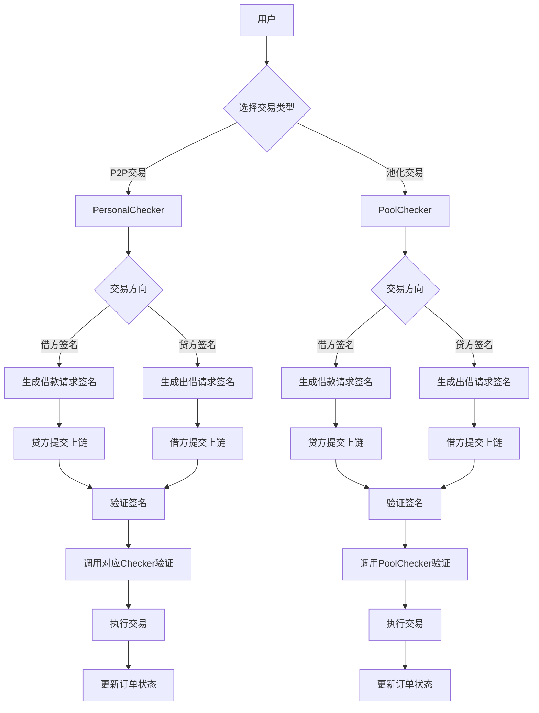
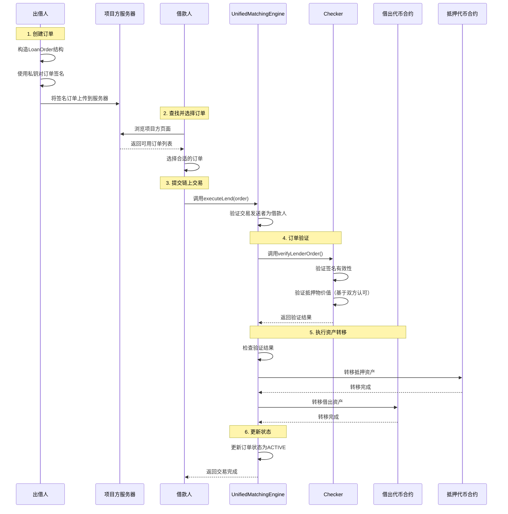
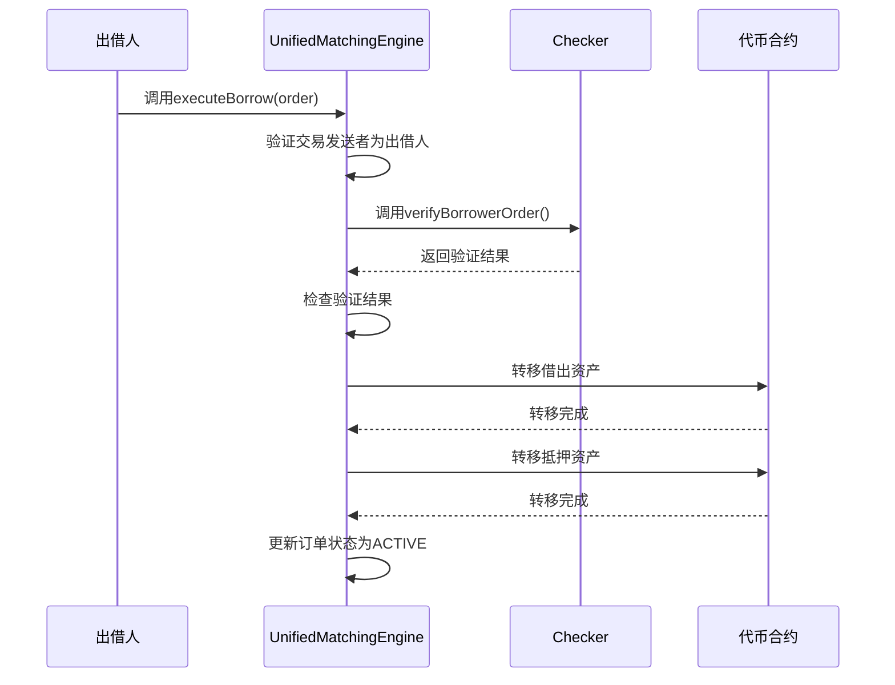
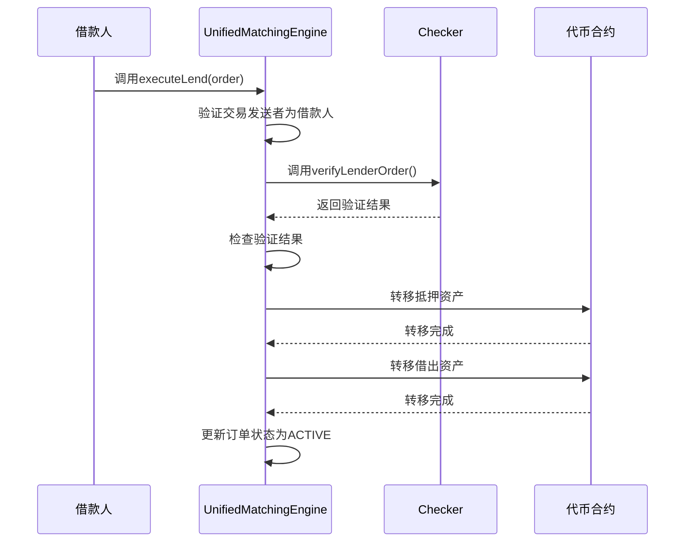
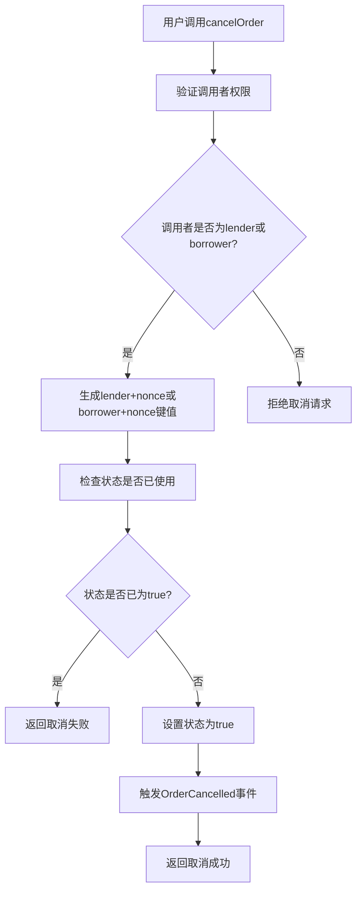
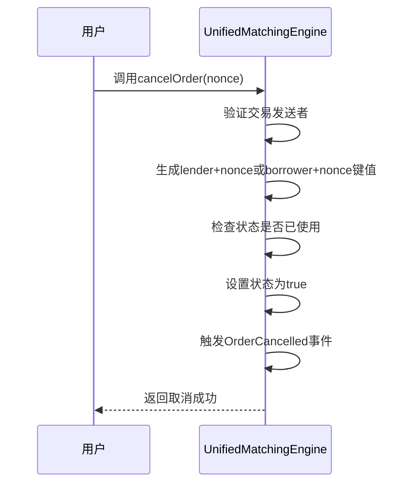

# 技术文档：统一撮合合约设计

## 1. 概述

统一撮合合约（UnifiedMatchingEngine）是一个去中心化的借贷交易撮合平台，支持个人对个人(P2P)借贷和池化资金借贷两种模式。该合约通过标准化的checker接口验证交易的有效性，并提供统一的接口处理借贷请求。

UnifiedMatchingEngine作为整个借贷生态系统的核心组件，负责订单管理、交易撮合、状态跟踪和资金流转控制。它不直接处理资金转移，而是通过调用相应的Checker验证合约和资金提供方（个人或池）来完成交易。

## 2. 设计目标

1. 提供统一的交易撮合接口，支持多种借贷模式
2. 实现灵活的checker验证机制，支持个人和池化资金验证
3. 支持离线签名交易，提高用户体验
4. 确保交易安全性和资金流动性
5. 采用链下订单存储，链上只保存订单状态，降低Gas费用
6. 实现模块化设计，便于扩展和维护
7. 提供完整的订单生命周期管理
8. 支持多种资产类型的借贷交易

## 3. 整体流程图

下面的流程图展示了系统的整体工作流程：



下面的时序图展示了从出借人签名创建链下交易到完成撮合的完整流程：



## 3. 核心组件

### 3.1 主要合约
- **UnifiedMatchingEngine**: 统一撮合引擎合约，负责交易撮合逻辑
- **IChecker**: 通用checker接口合约
- **PersonalChecker**: 个人交易验证checker实现
- **PoolChecker**: 池化资金验证checker实现

### 3.2 数据结构

#### 3.2.1 交易订单结构
```solidity
struct LoanOrder {
    address checker;         // Checker合约地址
    address lender;          // 出借人地址
    address borrower;        // 借款人地址
    address lendToken;       // 借出代币地址
    uint256 lendAmount;      // 借出金额
    address collateralToken;  // 抵押代币地址
    uint256 collateralAmount; // 抵押金额
    uint256 interestRate;    // 利率（基点）
    uint256 duration;        // 借款期限（秒）
    uint256 expiry;          // 过期时间
    uint256 nonce;           // 随机数
    bytes signature;         // 签名数据
}
```

#### 3.2.3 订单状态映射
```solidity
mapping(bytes32 => OrderStatus) public orderStatus;
```

#### 3.2.4 订单状态枚举
```solidity
enum OrderStatus {
    PENDING,    // 待撮合
    ACTIVE,     // 活跃中
    REPAID,     // 已还款
    LIQUIDATED, // 已清算
    CANCELLED   // 已取消
}
```

## 4. 核心功能

### 4.1 交易撮合接口

#### 4.1.1 发起借款请求（链下签名）
```solidity
function signBorrowRequest(LoanOrder calldata order) external view returns (bytes memory)
```
借款人在链下对借款请求进行签名，返回签名数据。

#### 4.1.2 发起出借请求（链下签名）
```solidity
function signLendRequest(LoanOrder calldata order) external view returns (bytes memory)
```
出借人在链下对出借请求进行签名，返回签名数据。

#### 4.1.3 执行借款交易
```solidity
function executeBorrow(LoanOrder calldata order) external
```
执行借款交易，需要携带完整订单信息。由于借方已在链下签名，贷方提交上链时已验证过签名，因此撮合合约中不再重复验证。撮合合约可以直接获取交易的msg.sender，因此只需验证链下签名的有效性。注意：verifyBorrowerOrder函数不会验证借款方的地址，因为借款方是由平台撮合的，可能是随机的。

下面的时序图展示了借款交易执行流程：



#### 4.1.4 执行出借交易
```solidity
function executeLend(LoanOrder calldata order) external
```
执行出借交易，需要携带完整订单信息。由于贷方已在链下签名，借方提交上链时已验证过签名，因此撮合合约中不再重复验证。撮合合约可以直接获取交易的msg.sender，因此只需验证链下签名的有效性。注意：verifyLenderOrder函数不会验证贷款方的地址，因为贷款方是由平台撮合的，可能是随机的。

下面的时序图展示了出借交易执行流程：



#### 4.1.5 还款
```solidity
function repayLoan(LoanOrder calldata order) external
```
执行还款操作，需要携带完整订单信息。

#### 4.1.6 清算
```solidity
function liquidateLoan(LoanOrder calldata order) external
```
执行清算操作，需要携带完整订单信息。

### 4.2 订单管理

#### 4.2.1 取消订单
```solidity
function cancelOrder(uint256 nonce) external
```
允许订单发起方取消未执行的订单。用户取消交易时，会直接设置对应的lender+nonce或borrower+nonce状态为true，防止该签名被再次使用。

下面的流程图展示了订单取消的详细机制：



下面的时序图展示了订单取消流程：



#### 4.2.2 查询订单状态
```solidity
function getOrderStatus(bytes32 orderHash) external view returns (OrderStatus)
```

### 4.3 资金管理

资金管理操作（还款和清算）已在4.1.5和4.1.6节中详细描述。

## 5. 安全机制

### 5.1 重入攻击防护
使用OpenZeppelin的ReentrancyGuard防止重入攻击。

### 5.2 签名验证
采用EIP-712标准进行离线签名验证，确保交易真实性。每个签名只生效一次，撮合合约会记录lender+nonce或borrower+nonce的状态为true，下次尝试再使用它，会因为已经为true而出错。用户取消交易，也应该是直接设置状态为true。

### 5.3 权限控制
通过访问控制确保只有授权方可以执行特定操作。

### 5.4 时间锁机制
关键操作需要经过时间锁延迟执行，提高安全性。

### 5.5 订单防重放
通过订单哈希和nonce机制防止订单重放攻击。每个签名只生效一次，撮合合约会记录lender+nonce或borrower+nonce的状态为true，下次尝试再使用它，会因为已经为true而出错。用户取消交易，也应该是直接设置状态为true。

### 5.6 抵押物价值验证
对于涉及资金池的交易，通过Chainlink预言机获取资产价格，验证抵押物价值是否满足要求（>=2*借款价值），确保资金安全。对于个人对个人交易，抵押物价值验证基于交易双方的认可，无需依赖预言机。

## 6. 事件日志

### 6.1 核心事件
- BorrowRequestInitiated: 借款请求发起
- LendRequestInitiated: 出借请求发起
- BorrowExecuted: 借款执行
- LendExecuted: 出借执行
- OrderCancelled: 订单取消（包含nonce信息）
- LoanRepaid: 贷款还款
- LoanLiquidated: 贷款清算

## 7. 部署架构

### 7.1 合约部署顺序
1. 部署IChecker接口合约
2. 部署PersonalChecker合约
3. 部署PoolChecker合约
4. 部署UnifiedMatchingEngine合约
5. 配置checker地址

### 7.2 初始化配置
- 设置checker合约地址
- 配置手续费参数
- 设置管理员权限